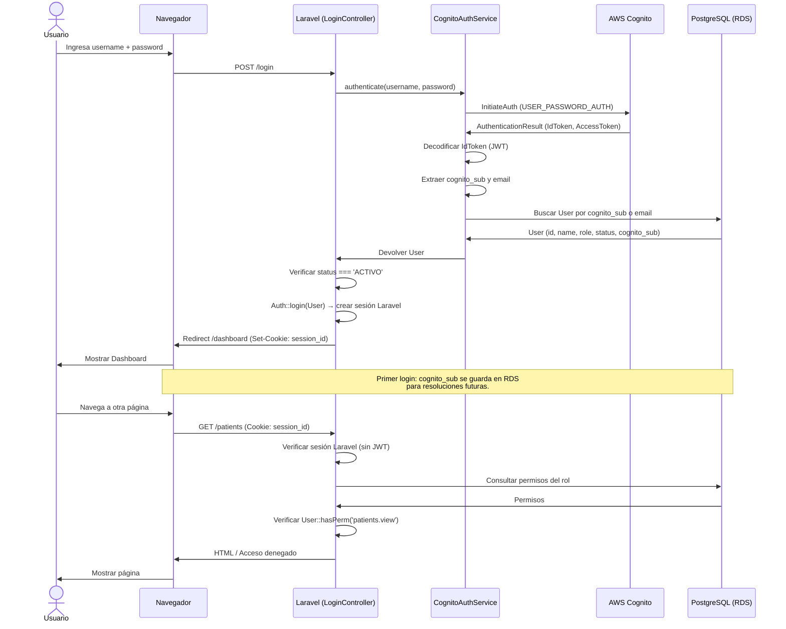

# MediCore — Cognito + Laravel + PostgreSQL PoC

PoC de autenticación con AWS Cognito y autorización local en PostgreSQL para una app de registros clínicos electrónicos.

## Stack
- Laravel 12 / PHP 8.2
- PostgreSQL (RDS)
- AWS Cognito (User Pool + App Client)
- Docker Compose

## Setup

1. **Clonar y levantar Docker:**
   ```bash
   docker compose up -d --build
   ```

2. **Instalar dependencias (si no se hizo en el entrypoint):**
   ```bash
   docker compose exec app composer install
   ```

3. **Ejecutar migraciones:**
   ```bash
   docker compose exec app php artisan migrate --force
   ```

4. **Ejecutar seeders:**
   ```bash
   docker compose exec app php artisan db:seed --force
   ```

5. **Acceder:**
   Abrir http://localhost:8080/login

## Usuarios de prueba (Cognito)

| Usuario | Contraseña | Rol esperado |
|---------|-----------|-------------|
| ADMIN | AdminTest#123456 | admin |
| ENFERMERA | EnfermeraTest#123456 | enfermera |
| CAJERO | CajeroTest#123456 | cajero |
| INACTIVO | (no existe en Cognito) | cajero (inactivo) |

## Pruebas por rol

- **ADMIN:** puede acceder a Dashboard, Usuarios, Pacientes, Caja.
- **ENFERMERA:** puede acceder a Dashboard y Pacientes. NO Usuarios.
- **CAJERO:** puede acceder a Dashboard y Caja (abrir/cerrar). NO Usuarios.
- **INACTIVO:** aunque exista en Cognito, no existe en Cognito (pero si en local como inactivo). Si se creara en Cognito, el login sería rechazado por "Usuario no está activo".

## Arquitectura

- **Autenticación:** AWS Cognito `InitiateAuth` con `USER_PASSWORD_AUTH`.
- **Sesión:** Laravel native `web` guard con sesiones (`SESSION_DRIVER=file`).
- **Autorización:** Roles y permisos en PostgreSQL (tablas `configuracion.roles`, `configuracion.permissions`, `configuracion.role_has_permissions`).
- **NO JWT validation** en cada request. Solo sesión Laravel.
- **NO Cognito Hosted UI**, NO OAuth callbacks, NO User Migration Lambda.

### Diagrama de secuencia (login)



## Configuración

Las variables de entorno están en `.env`. Claves Cognito:
- `COGNITO_USER_POOL_ID`
- `COGNITO_CLIENT_ID`
- `COGNITO_CLIENT_SECRET`
- `COGNITO_REGION`
